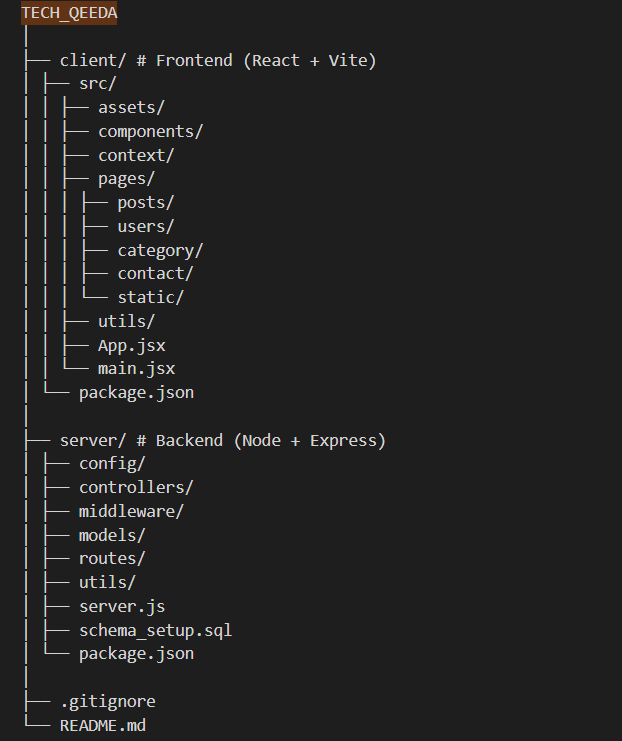

# Tech_Qeeda 🐛 - Tech Blog Application

## ✨ Description

Tech_Qeeda is a full-stack web application for a tech blog, featuring user authentication, post management, commenting, liking, categories, and contact forms. It includes an admin panel for managing users, posts, categories, and contact queries.

## 🚀 Features

- User authentication (login/register)
- Role-based access (admin/user)
- Create, edit, view blog posts
- Comment on posts
- Like posts
- Categorize posts
- Contact form for queries
- Admin dashboard for management
- Responsive design with Tailwind CSS
- Markdown editor for posts

## 🧩 Tech Stack

### Frontend

- React (Vite)
- React Router DOM
- Tailwind CSS
- Axios for API calls
- React Icons
- EasyMDE for markdown editing

### Backend

- Node.js
- Express.js
- MySQL
- JWT for authentication
- bcrypt for password hashing
- Multer for file uploads
- Nodemailer for emails
- CORS

## Prerequisites

- Node.js (v14 or higher)
- MySQL
- npm or yarn

## 📁 Project Structure



## ⚙️ Installation

1. Clone the repository:

   ```
   git clone <repository-url>
   cd Tech_Qeeda
   ```

2. Install dependencies for client:

   ```
   cd client
   npm install
   ```

3. Install dependencies for server:

   ```
   cd ../server
   npm install
   ```

4. Set up environment variables:
   Create a `.env` file in the server directory with:

   ```
   PORT=5000
   DB_HOST=localhost
   DB_USER=your_db_user
   DB_PASS=your_db_password
   DB_NAME=tech_blog
   JWT_SECRET=your_jwt_secret
   
   MAIL_HOST=smtp.gmail.com
   MAIL_PORT=587
   MAIL_USER=your_email@gmail.com
   MAIL_PASS=your_email_password
   MAIL_FROM="TechQeeda🐛 <youmailxxxxxx@gmail.com>"
   ```

5. Set up the database:

   - Create a MySQL database named `tech_blog`
   - Run the SQL script in `server/schema_setup.sql` to create tables

6. Start the server:

   ```
   npm run dev
   ```

7. Start the client (in a new terminal):
   ```
   cd client
   npm run dev
   ```

## 👑 Admin Setup

To access the admin panel, the first admin user must be created manually.

Run the admin seed script:

```bash
cd server
node server/setupAdmin.js
```

## ▶️ Usage

- Visit `http://localhost:5173` for the frontend
- API is available at `http://localhost:5000`


---

## 🔐 User Roles & Permissions

### 👤 Normal User
- Register & login
- View all blog posts
- Filter posts by category
- Like / unlike posts
- Add, edit & delete own comments
- Create & edit own posts
- Contact admin via Contact Us form

---

### 🛡️ Admin
- All user permissions
- Create, edit & delete categories
- Create users manually
- Enable / disable users
- View & resolve contact queries
- Edit or delete **any** post
- Export users list
- Full dashboard access

---

## ✍️ Markdown Blog Editor

Posts are written using **Markdown syntax**.

### ✨ Supported Features

* Headings (`##`, `###`, `####`)
* Bold & Italic text
* Ordered & unordered lists
* Horizontal rules (`---`)
* Live preview & side-by-side editor mode

### 📝 Example

```md
## Section Heading

- First point
- Second point

**Bold text**
```

---

## Database Setup

Run the `schema_setup.sql` file in your MySQL database to set up the required tables.

---

## Contributing

1. Fork the repository
2. Create a feature branch
3. Commit your changes
4. Push to the branch
5. Open a Pull Request

---

## 🧑‍💻 Author

**Arpit Pandey**
- Full Stack Developer
- React • Node.js • Express • MySQL • Tailwind CSS

---

## License

This project is licensed under the ISC License.
